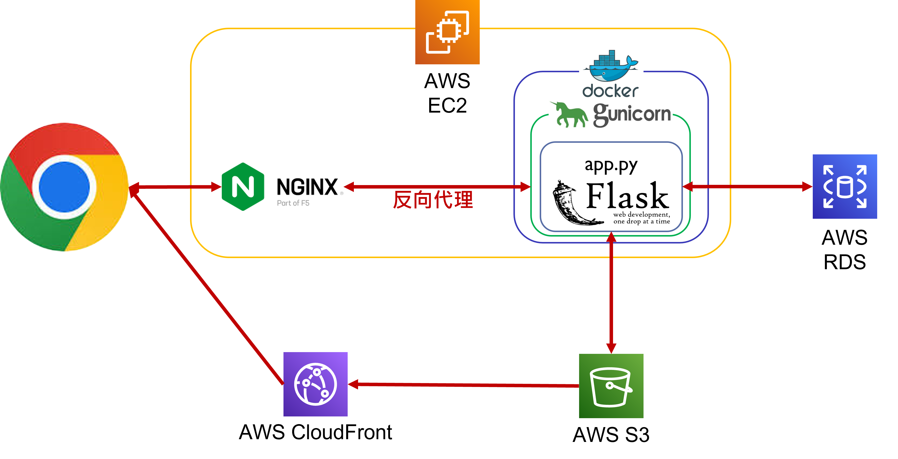

# Taipei Day Trip Website 台北一日遊

## 網址
https://tour.yin888.info/

## 簡介
匯集台北的旅遊景點，導覽並深度解析各景點的特色。

## 功能
*  訪客
    *   景點資訊
    *   景點交通
*  會員
    *   景點導覽

## 網頁架構

## 使用工具
*   AWS
    *   EC2
     可擴展的運算容量，部署網頁應用程式。
    *   RDS
     雲端關聯式資料庫，此專案使用其中 MySQL 資料庫。
    *   S3
     雲端物件儲存，用於儲存景點資訊，避免浪費資料庫資源。
    *   CloudFront
     低延遲內容交付網路 ( CDN ) ，將資料儲存至全球各地的多個伺服器節點。
*   Python
    *   flask
     開發網頁應用框架。
    *   dotenv
     取用.env的資訊，避免洩漏私密資訊。
    *   mysql.connector.pooling
     使用連線池，有效利用資料庫資源。
    *   jwt
     保存會員登入狀態、身分認證及挾帶非私密的資料。
    *   boto3
     AWS 開發套件，上傳資料至 AWS S3 。
*   JavaScript
     網頁程式撰寫， DOM 控制。
*   API
    *   TapPay
     安全電子商務服務，金流服務API。 ( https://www.tappaysdk.com/zh/ )
*   Others
    *   Docker
     輕量級的虛擬化技術，跨平台部屬專案。
    *   nginx
     網頁伺服器，此專案應用其反向代理 ( Reverse Proxy ) 的功能。
    *   git
     版本控管工具。

## 問題解決
1. 問題：資料庫儲存圖片資料適合使用 string ( Base64 ) 還是 Blob 格式
    * 解決方案：
        - [ ] Base64
            *   儲存格式大小為Blob格式的 1.3 倍
        - [x] Blob
            *   從資料庫取出資料需再經過 base64 編譯，才能透過透過 API 使用

    參考資料：https://stackoverflow.com/questions/29284266/mysql-base64-vs-blob

2. 問題：資料庫連線過載，導致無法取用資料庫的資源
    * 尋找真因：
     取用資料庫資源的函式發生錯誤，但並未關閉連線池對資料庫的連線。
    * 解決方案：
     except的狀況條件發生時，執行close連線池對資料庫的連線。